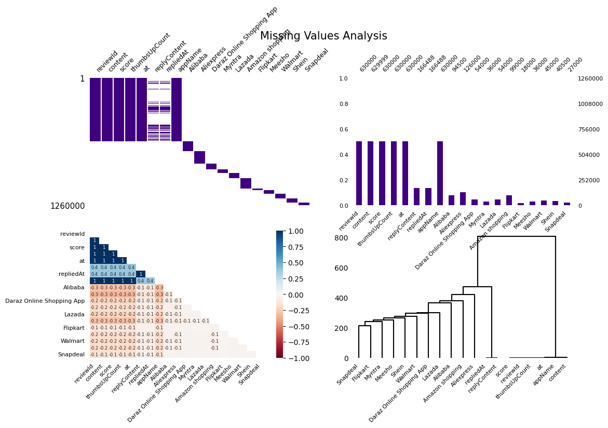
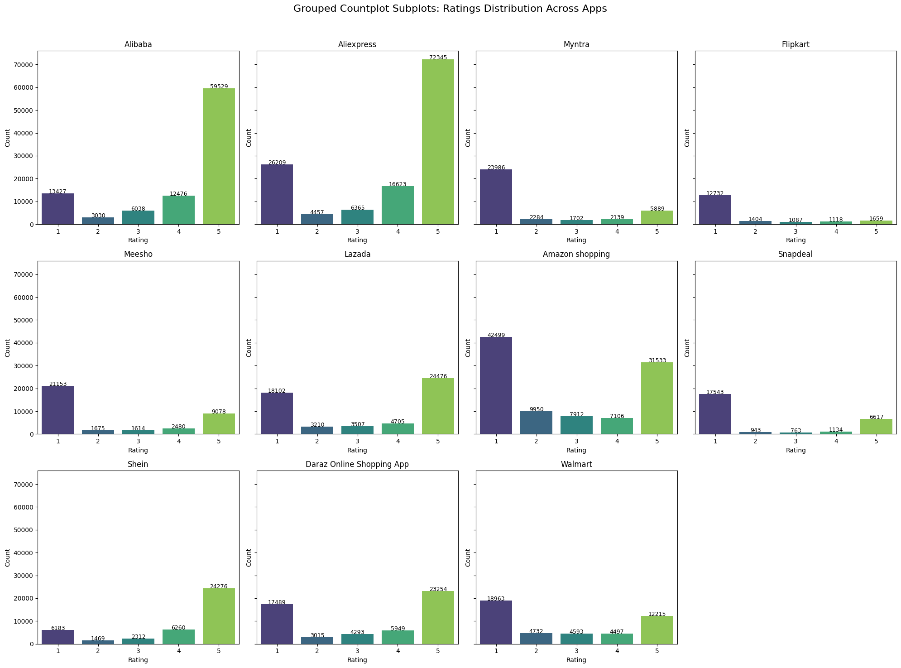
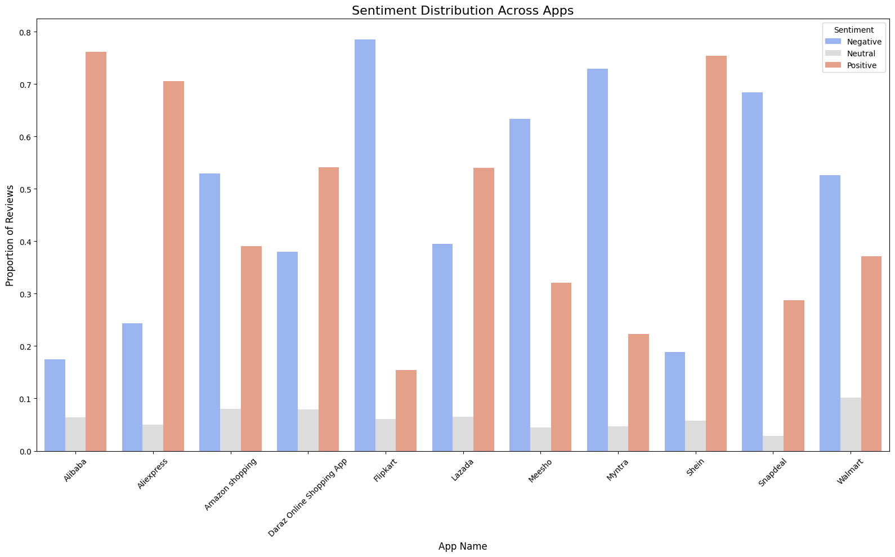
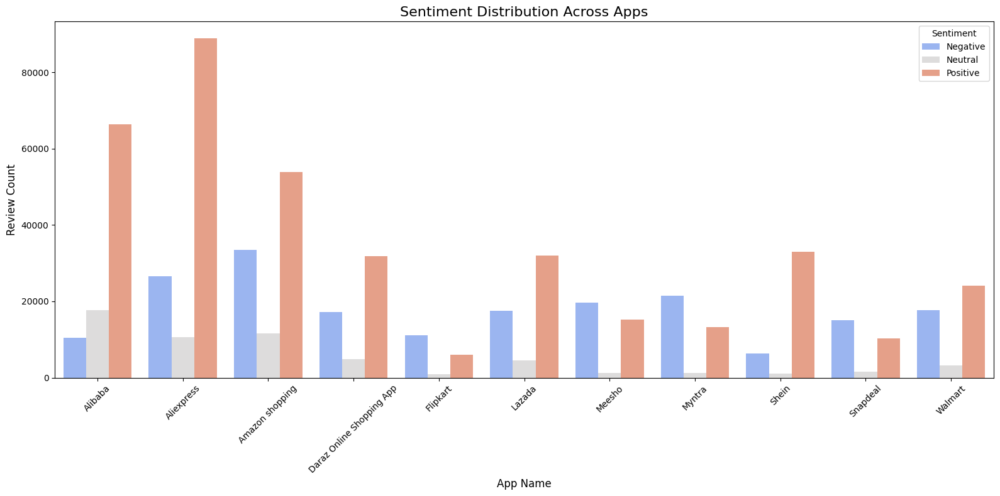
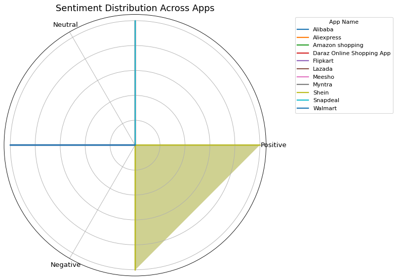

# <div style="color:blue;display:inline-block;border-radius:5px;background-color:#F0E68C;font-family:Nexa;overflow:hidden"><p style="padding:15px;color:blue;overflow:hidden;font-size:90%;letter-spacing:0.5px;margin:0"><b> </b> Import Modules</p></div>


```python
import seaborn as sns
import matplotlib.pyplot as plt
import pandas as pd
import numpy as np
import json
import os

from wordcloud import WordCloud
import warnings
warnings.filterwarnings("ignore")
```

# <div style="color:blue;display:inline-block;border-radius:5px;background-color:#F0E68C;font-family:Nexa;overflow:hidden"><p style="padding:15px;color:blue;overflow:hidden;font-size:100%;letter-spacing:0.5px;margin:0"><b> </b> Load the Dataset</p></div>


```python

# Paths
csv_files = [
    "/kaggle/input/shoppingappreviews-dataset/ShoppingAppReviews Dataset/ShoppingAppReviews/csv/Alibaba.csv",
    "/kaggle/input/shoppingappreviews-dataset/ShoppingAppReviews Dataset/ShoppingAppReviews/csv/Aliexpress.csv",
    "/kaggle/input/shoppingappreviews-dataset/ShoppingAppReviews Dataset/ShoppingAppReviews/csv/Myntra.csv",
    "/kaggle/input/shoppingappreviews-dataset/ShoppingAppReviews Dataset/ShoppingAppReviews/csv/Flipkart.csv",
    "/kaggle/input/shoppingappreviews-dataset/ShoppingAppReviews Dataset/ShoppingAppReviews/csv/Meesho.csv",
    "/kaggle/input/shoppingappreviews-dataset/ShoppingAppReviews Dataset/ShoppingAppReviews/csv/Lazada.csv",
    "/kaggle/input/shoppingappreviews-dataset/ShoppingAppReviews Dataset/ShoppingAppReviews/csv/Amazon shopping.csv",
    "/kaggle/input/shoppingappreviews-dataset/ShoppingAppReviews Dataset/ShoppingAppReviews/csv/Snapdeal.csv",
    "/kaggle/input/shoppingappreviews-dataset/ShoppingAppReviews Dataset/ShoppingAppReviews/csv/Shein.csv",
    "/kaggle/input/shoppingappreviews-dataset/ShoppingAppReviews Dataset/ShoppingAppReviews/csv/Daraz Online Shopping App.csv",
    "/kaggle/input/shoppingappreviews-dataset/ShoppingAppReviews Dataset/ShoppingAppReviews/csv/Walmart.csv"
]
json_files = [
    "/kaggle/input/shoppingappreviews-dataset/ShoppingAppReviews Dataset/ShoppingAppReviews/json/Alibaba.json",
    "/kaggle/input/shoppingappreviews-dataset/ShoppingAppReviews Dataset/ShoppingAppReviews/json/Aliexpress.json",
    "/kaggle/input/shoppingappreviews-dataset/ShoppingAppReviews Dataset/ShoppingAppReviews/json/Daraz Online Shopping App.json",
    "/kaggle/input/shoppingappreviews-dataset/ShoppingAppReviews Dataset/ShoppingAppReviews/json/Myntra.json",
    "/kaggle/input/shoppingappreviews-dataset/ShoppingAppReviews Dataset/ShoppingAppReviews/json/Lazada.json",
    "/kaggle/input/shoppingappreviews-dataset/ShoppingAppReviews Dataset/ShoppingAppReviews/json/Amazon shopping.json",
    "/kaggle/input/shoppingappreviews-dataset/ShoppingAppReviews Dataset/ShoppingAppReviews/json/Flipkart.json",
    "/kaggle/input/shoppingappreviews-dataset/ShoppingAppReviews Dataset/ShoppingAppReviews/json/Meesho.json",
    "/kaggle/input/shoppingappreviews-dataset/ShoppingAppReviews Dataset/ShoppingAppReviews/json/Walmart.json",
    "/kaggle/input/shoppingappreviews-dataset/ShoppingAppReviews Dataset/ShoppingAppReviews/json/Shein.json",
    "/kaggle/input/shoppingappreviews-dataset/ShoppingAppReviews Dataset/ShoppingAppReviews/json/Snapdeal.json"
]

# Load CSV
csv_data = {os.path.basename(f).split('.')[0]: pd.read_csv(f) for f in csv_files}

# Load JSON
json_data = {}
for f in json_files:
    with open(f, 'r') as file:
        json_data[os.path.basename(f).split('.')[0]] = pd.json_normalize(json.load(file))

```


```python
csv_data["Alibaba"].head()
```


<div>
<style scoped>
    .dataframe tbody tr th:only-of-type {
        vertical-align: middle;
    }

    .dataframe tbody tr th {
        vertical-align: top;
    }

    .dataframe thead th {
        text-align: right;
    }
</style>
<table border="1" class="dataframe">
  <thead>
    <tr style="text-align: right;">
      <th></th>
      <th>reviewId</th>
      <th>content</th>
      <th>score</th>
      <th>thumbsUpCount</th>
      <th>at</th>
      <th>replyContent</th>
      <th>repliedAt</th>
      <th>appName</th>
    </tr>
  </thead>
  <tbody>
    <tr>
      <th>0</th>
      <td>275f465b-a58b-439e-ae7c-f9f6dcf2634d</td>
      <td>Trying to use the on website is almost impossi...</td>
      <td>1</td>
      <td>39</td>
      <td>1720995717000</td>
      <td>Hi, we are sorry to hear that. Do share additi...</td>
      <td>1.721048e+12</td>
      <td>Alibaba</td>
    </tr>
    <tr>
      <th>1</th>
      <td>e6c13852-277e-451a-b8d5-dd92aea75402</td>
      <td>Had to uninstall due to the amount of notifica...</td>
      <td>3</td>
      <td>60</td>
      <td>1720501958000</td>
      <td>Hi, we are sorry to hear that. Do share additi...</td>
      <td>1.721051e+12</td>
      <td>Alibaba</td>
    </tr>
    <tr>
      <th>2</th>
      <td>254b3705-c54b-4ce4-8982-5b468d38231d</td>
      <td>I order and it takes too long the shpping days...</td>
      <td>1</td>
      <td>7</td>
      <td>1721866371000</td>
      <td>NaN</td>
      <td>NaN</td>
      <td>Alibaba</td>
    </tr>
    <tr>
      <th>3</th>
      <td>c83c1e64-6aa3-42e8-9a56-0385a297b87b</td>
      <td>Buyer beware! They have tons of listings that ...</td>
      <td>1</td>
      <td>2301</td>
      <td>1611569460000</td>
      <td>NaN</td>
      <td>NaN</td>
      <td>Alibaba</td>
    </tr>
    <tr>
      <th>4</th>
      <td>7a65dce8-3f09-4e4e-a263-55efebc13c65</td>
      <td>It's all around a great app except for the fac...</td>
      <td>4</td>
      <td>1859</td>
      <td>1545438323000</td>
      <td>Thanks for your feedback. Could you tell us mo...</td>
      <td>1.515586e+12</td>
      <td>Alibaba</td>
    </tr>
  </tbody>
</table>
</div>


```python
# Load CSV files into DataFrame
csv_data = [pd.read_csv(file) for file in csv_files]

# Load JSON files into DataFrame
json_data = [pd.DataFrame(json.load(open(file))) for file in json_files]

# Combine CSV and JSON data
combined_df = pd.concat(csv_data + json_data, ignore_index=True)
```


```python
import missingno as msno

fig, ax = plt.subplots(2,2,figsize=(12,7))
axs = np.ravel(ax)
msno.matrix(combined_df,  fontsize=9, color=(0.25,0,0.5),ax=axs[0]);
msno.bar(combined_df, fontsize=8, color=(0.25,0,0.5), ax=axs[1]);
msno.heatmap(combined_df,fontsize=8,ax=axs[2]);
msno.dendrogram(combined_df,fontsize=8,ax=axs[3], orientation='top')

fig.suptitle('Missing Values Analysis', y=1.01, fontsize=15)

# Save the plot
plt.savefig('missing_values_analysis.png')

# Show the plot
plt.show()
```


    

    


# <div style="color:blue;display:inline-block;border-radius:5px;background-color:#F0E68C;font-family:Nexa;overflow:hidden"><p style="padding:15px;color:blue;overflow:hidden;font-size:100%;letter-spacing:0.5px;margin:0"><b> </b> Data Cleaning</p></div>


```python
print(combined_df.columns)
```

    Index(['reviewId', 'content', 'score', 'thumbsUpCount', 'at', 'replyContent',
           'repliedAt', 'appName', 'Alibaba', 'Aliexpress',
           'Daraz Online Shopping App', 'Myntra', 'Lazada', 'Amazon shopping',
           'Flipkart', 'Meesho', 'Walmart', 'Shein', 'Snapdeal'],
          dtype='object')


```python
combined_df.info()
```

    <class 'pandas.core.frame.DataFrame'>
    RangeIndex: 1260000 entries, 0 to 1259999
    Data columns (total 19 columns):
     #   Column                     Non-Null Count   Dtype  
    ---  ------                     --------------   -----  
     0   reviewId                   630000 non-null  object 
     1   content                    629999 non-null  object 
     2   score                      630000 non-null  float64
     3   thumbsUpCount              630000 non-null  float64
     4   at                         630000 non-null  float64
     5   replyContent               166488 non-null  object 
     6   repliedAt                  166488 non-null  float64
     7   appName                    630000 non-null  object 
     8   Alibaba                    94500 non-null   object 
     9   Aliexpress                 126000 non-null  object 
     10  Daraz Online Shopping App  54000 non-null   object 
     11  Myntra                     36000 non-null   object 
     12  Lazada                     54000 non-null   object 
     13  Amazon shopping            99000 non-null   object 
     14  Flipkart                   18000 non-null   object 
     15  Meesho                     36000 non-null   object 
     16  Walmart                    45000 non-null   object 
     17  Shein                      40500 non-null   object 
     18  Snapdeal                   27000 non-null   object 
    dtypes: float64(4), object(15)
    memory usage: 182.6+ MB


```python
# Check for missing values
print(combined_df.isnull().sum())
```

    reviewId                      630000
    content                       630001
    score                         630000
    thumbsUpCount                 630000
    at                            630000
    replyContent                 1093512
    repliedAt                    1093512
    appName                       630000
    Alibaba                      1165500
    Aliexpress                   1134000
    Daraz Online Shopping App    1206000
    Myntra                       1224000
    Lazada                       1206000
    Amazon shopping              1161000
    Flipkart                     1242000
    Meesho                       1224000
    Walmart                      1215000
    Shein                        1219500
    Snapdeal                     1233000
    dtype: int64


```python
# Drop rows where reviews or ratings are missing
combined_df = combined_df.dropna(subset=['content', 'score'])

# Verify the result
print(combined_df.isnull().sum())

```

    reviewId                          0
    content                           0
    score                             0
    thumbsUpCount                     0
    at                                0
    replyContent                 463511
    repliedAt                    463511
    appName                           0
    Alibaba                      629999
    Aliexpress                   629999
    Daraz Online Shopping App    629999
    Myntra                       629999
    Lazada                       629999
    Amazon shopping              629999
    Flipkart                     629999
    Meesho                       629999
    Walmart                      629999
    Shein                        629999
    Snapdeal                     629999
    dtype: int64


```python
# Ensure 'score' is treated as a categorical variable
combined_df['score'] = combined_df['score'].astype(int)

# Preview the data
combined_df[['appName', 'score']].head()

```


<div>
<style scoped>
    .dataframe tbody tr th:only-of-type {
        vertical-align: middle;
    }

    .dataframe tbody tr th {
        vertical-align: top;
    }

    .dataframe thead th {
        text-align: right;
    }
</style>
<table border="1" class="dataframe">
  <thead>
    <tr style="text-align: right;">
      <th></th>
      <th>appName</th>
      <th>score</th>
    </tr>
  </thead>
  <tbody>
    <tr>
      <th>0</th>
      <td>Alibaba</td>
      <td>1</td>
    </tr>
    <tr>
      <th>1</th>
      <td>Alibaba</td>
      <td>3</td>
    </tr>
    <tr>
      <th>2</th>
      <td>Alibaba</td>
      <td>1</td>
    </tr>
    <tr>
      <th>3</th>
      <td>Alibaba</td>
      <td>1</td>
    </tr>
    <tr>
      <th>4</th>
      <td>Alibaba</td>
      <td>4</td>
    </tr>
  </tbody>
</table>
</div>


# <div style="color:blue;display:inline-block;border-radius:5px;background-color:#F0E68C;font-family:Nexa;overflow:hidden"><p style="padding:15px;color:blue;overflow:hidden;font-size:100%;letter-spacing:0.5px;margin:0"><b> </b> Exploratory Data Analysis (EDA)📊</p></div>


```python
# Get a list of unique apps
apps = combined_df['appName'].unique()

# Define the subplot grid (e.g., 3 rows x 4 columns)
rows, cols = 3, 4
fig, axes = plt.subplots(rows, cols, figsize=(20, 15), sharey=True)
axes = axes.flatten()

# Plot countplots for each app
for i, app in enumerate(apps):
    ax = axes[i]
    app_data = combined_df[combined_df['appName'] == app]
    
    sns.countplot(
        data=app_data, 
        x='score', 
        ax=ax, 
        palette='viridis', 
        order=sorted(app_data['score'].unique())
    )
    ax.set_title(app, fontsize=12)
    ax.set_xlabel('Rating', fontsize=10)
    ax.set_ylabel('Count', fontsize=10)
    
    # Annotate bar heights
    for p in ax.patches:
        height = p.get_height()
        if height > 0:  # Only annotate bars with a height greater than 0
            ax.text(
                p.get_x() + p.get_width() / 2.,
                height + 1,
                f'{int(height)}',
                ha='center',
                fontsize=9
            )

# Remove unused subplots (if any apps < rows*cols)
for j in range(len(apps), len(axes)):
    fig.delaxes(axes[j])

# Add a global title
plt.suptitle('Grouped Countplot Subplots: Ratings Distribution Across Apps', fontsize=16)
plt.tight_layout(rect=[0, 0, 1, 0.96])
plt.show()

```


    

    


# <font size="+3" color='#059c99'><b> Analyze the Best-Performing Apps</b></font>


```python
# Define sentiment labels
def categorize_sentiment(score):
    if score >= 4:
        return 'Positive'
    elif score == 3:
        return 'Neutral'
    else:
        return 'Negative'

# Apply sentiment categorization
combined_df['sentiment'] = combined_df['score'].apply(categorize_sentiment)

# Count sentiments per app
sentiment_counts = (
    combined_df.groupby(['appName', 'sentiment'])
    .size()
    .reset_index(name='count')  # Reset index to get 'count' as a column
)

# Calculate proportions per app
sentiment_counts['proportion'] = sentiment_counts.groupby('appName')['count'].transform(lambda x: x / x.sum())

# Plotting
plt.figure(figsize=(16, 10))
sns.barplot(data=sentiment_counts, x='appName', y='proportion', hue='sentiment', palette='coolwarm')
plt.title('Sentiment Distribution Across Apps', fontsize=16)
plt.xlabel('App Name', fontsize=12)
plt.ylabel('Proportion of Reviews', fontsize=12)
plt.xticks(rotation=45, fontsize=10)
plt.legend(title='Sentiment', loc='upper right')
plt.tight_layout()
plt.show()

```


    

    


```python
# Calculate the percentage of positive reviews per app
app_performance = combined_df.groupby('appName')['sentiment'].apply(lambda x: (x == 'positive').mean() * 100).reset_index(name='positive_percentage')

# Identify top 3 apps with the highest percentage of positive reviews
top_apps = app_performance.sort_values('positive_percentage', ascending=False).head(3)['appName'].values
print("Top Performing Apps:", top_apps)

# Extract reviews for these top apps
top_apps_reviews = combined_df[combined_df['appName'].isin(top_apps)]

# Group by app name and sentiment to analyze trends
top_app_trends = top_apps_reviews.groupby(['appName', 'sentiment']).size().unstack(fill_value=0)
print(top_app_trends)

```

    Top Performing Apps: ['Alibaba' 'Aliexpress' 'Amazon shopping']
    sentiment        Negative  Neutral  Positive
    appName                                     
    Alibaba             16457     6038     72005
    Aliexpress          30666     6365     88968
    Amazon shopping     52449     7912     38639


# <div style="color:blue;display:inline-block;border-radius:5px;background-color:#F0E68C;font-family:Nexa;overflow:hidden"><p style="padding:15px;color:blue;overflow:hidden;font-size:100%;letter-spacing:0.5px;margin:0"><b> </b> Dynamic Sentiment Analysis </p></div>

- We will use a popular NLP package, VADER, to dynamically classify the sentiment of reviews based on their content. VADER work well with social media-type text, which includes informal language and slang.

# <font size="+2" color='#059c99'><b> Install the required libraries</b></font>

- We need `nltk` and `vaderSentiment`


```python
pip install nltk vaderSentiment
```

    Requirement already satisfied: nltk in /opt/conda/lib/python3.10/site-packages (3.2.4)
    Collecting vaderSentiment
      Downloading vaderSentiment-3.3.2-py2.py3-none-any.whl.metadata (572 bytes)
    Requirement already satisfied: six in /opt/conda/lib/python3.10/site-packages (from nltk) (1.16.0)
    Requirement already satisfied: requests in /opt/conda/lib/python3.10/site-packages (from vaderSentiment) (2.32.3)
    Requirement already satisfied: charset-normalizer<4,>=2 in /opt/conda/lib/python3.10/site-packages (from requests->vaderSentiment) (3.3.2)
    Requirement already satisfied: idna<4,>=2.5 in /opt/conda/lib/python3.10/site-packages (from requests->vaderSentiment) (3.7)
    Requirement already satisfied: urllib3<3,>=1.21.1 in /opt/conda/lib/python3.10/site-packages (from requests->vaderSentiment) (1.26.18)
    Requirement already satisfied: certifi>=2017.4.17 in /opt/conda/lib/python3.10/site-packages (from requests->vaderSentiment) (2024.6.2)
    Downloading vaderSentiment-3.3.2-py2.py3-none-any.whl (125 kB)
       ━━━━━━━━━━━━━━━━━━━━━━━━━━━━━━━━━━━━━━━━ 126.0/126.0 kB 3.6 MB/s eta 0:00:00
    [?25hInstalling collected packages: vaderSentiment
    Successfully installed vaderSentiment-3.3.2
    Note: you may need to restart the kernel to use updated packages.


# <font size="+3" color='#059c99'><b> Sentiment Analysis with VADER</b></font>

- We'll create a function to classify the sentiment of each review using VADER and apply it to the `content` column.


```python
from vaderSentiment.vaderSentiment import SentimentIntensityAnalyzer

# Initialize VADER Sentiment Analyzer
analyzer = SentimentIntensityAnalyzer()

# Function to classify sentiment based on VADER scores
def classify_sentiment(review):
    sentiment_score = analyzer.polarity_scores(review)
    compound_score = sentiment_score['compound']
    
    # Classify sentiment based on compound score
    if compound_score >= 0.05:
        return 'Positive'
    elif compound_score <= -0.05:
        return 'Negative'
    else:
        return 'Neutral'

# Apply sentiment classification to the review content
combined_df['sentiment'] = combined_df['content'].apply(classify_sentiment)

```

# <font size="+2" color='#059c99'><b> Review the output </b></font>


```python
combined_df[['content', 'sentiment']].head()
```


<div>
<style scoped>
    .dataframe tbody tr th:only-of-type {
        vertical-align: middle;
    }

    .dataframe tbody tr th {
        vertical-align: top;
    }

    .dataframe thead th {
        text-align: right;
    }
</style>
<table border="1" class="dataframe">
  <thead>
    <tr style="text-align: right;">
      <th></th>
      <th>content</th>
      <th>sentiment</th>
    </tr>
  </thead>
  <tbody>
    <tr>
      <th>0</th>
      <td>Trying to use the on website is almost impossi...</td>
      <td>Negative</td>
    </tr>
    <tr>
      <th>1</th>
      <td>Had to uninstall due to the amount of notifica...</td>
      <td>Negative</td>
    </tr>
    <tr>
      <th>2</th>
      <td>I order and it takes too long the shpping days...</td>
      <td>Negative</td>
    </tr>
    <tr>
      <th>3</th>
      <td>Buyer beware! They have tons of listings that ...</td>
      <td>Negative</td>
    </tr>
    <tr>
      <th>4</th>
      <td>It's all around a great app except for the fac...</td>
      <td>Positive</td>
    </tr>
  </tbody>
</table>
</div>


# <font size="+2" color='#059c99'><b> Clustering Apps Based on Review Characteristics </b></font>

- Now, let's use K-Means clustering to group apps based on review length and sentiment. For sentiment, we'll convert the sentiment labels into numerical values (`Positive=1`,`Neutral =0`, `Negative = -1`).


```python
sentiment_map = {'Positive': 1, 'Neutral': 0, 'Negative': -1}
combined_df['sentiment_num'] = combined_df['sentiment'].map(sentiment_map)
```

# <font size="+2" color='#059c99'><b> Select features for clustering</b></font>

- We will use the review length and sentiment as features for clustering


```python
# Create 'review_length' column based on the length of each review
combined_df['review_length'] = combined_df['content'].apply(len)

if 'sentiment_num' not in combined_df.columns:
    sentiment_mapping = {'positive': 1, 'negative': -1, 'neutral': 0}
    combined_df['sentiment_num'] = combined_df['sentiment'].map(sentiment_mapping)

# Now you can extract 'review_length' and 'sentiment_num' for analysis
X = combined_df[['review_length', 'sentiment_num']]

# Preview the result
print(X.head())

```

       review_length  sentiment_num
    0            362             -1
    1            369             -1
    2            499             -1
    3            494             -1
    4            401              1


# <font size="+2" color='#059c99'><b> Normalize the features </b></font>

- Clustering often performs better when the data is normalized.


```python
from sklearn.preprocessing import StandardScaler
scaler = StandardScaler()
X_scaled = scaler.fit_transform(X)

```

# <font size="+2" color='#059c99'><b> K-Means clustering </b></font>


```python
from sklearn.cluster import KMeans

# Choose the number of clusters (e.g., 3 clusters)
kmeans = KMeans(n_clusters=3, random_state=42)
combined_df['cluster'] = kmeans.fit_predict(X_scaled)

```

# <font size="+2" color='#059c99'><b> Review cluster results</b></font>

- Now, you can inspect how the apps are clustered based on review length and sentiment.


```python
combined_df[['appName', 'review_length', 'sentiment', 'cluster']].head()

```


<div>
<style scoped>
    .dataframe tbody tr th:only-of-type {
        vertical-align: middle;
    }

    .dataframe tbody tr th {
        vertical-align: top;
    }

    .dataframe thead th {
        text-align: right;
    }
</style>
<table border="1" class="dataframe">
  <thead>
    <tr style="text-align: right;">
      <th></th>
      <th>appName</th>
      <th>review_length</th>
      <th>sentiment</th>
      <th>cluster</th>
    </tr>
  </thead>
  <tbody>
    <tr>
      <th>0</th>
      <td>Alibaba</td>
      <td>362</td>
      <td>Negative</td>
      <td>0</td>
    </tr>
    <tr>
      <th>1</th>
      <td>Alibaba</td>
      <td>369</td>
      <td>Negative</td>
      <td>0</td>
    </tr>
    <tr>
      <th>2</th>
      <td>Alibaba</td>
      <td>499</td>
      <td>Negative</td>
      <td>0</td>
    </tr>
    <tr>
      <th>3</th>
      <td>Alibaba</td>
      <td>494</td>
      <td>Negative</td>
      <td>0</td>
    </tr>
    <tr>
      <th>4</th>
      <td>Alibaba</td>
      <td>401</td>
      <td>Positive</td>
      <td>0</td>
    </tr>
  </tbody>
</table>
</div>


```python
# Aggregate sentiment counts per app
sentiment_counts = combined_df.groupby(['appName', 'sentiment']).size().reset_index(name='count')

# Plotting
plt.figure(figsize=(16, 8))
sns.barplot(data=sentiment_counts, x='appName', y='count', hue='sentiment', palette='coolwarm')

# Customizing the plot
plt.title('Sentiment Distribution Across Apps', fontsize=16)
plt.xlabel('App Name', fontsize=12)
plt.ylabel('Review Count', fontsize=12)
plt.xticks(rotation=45, fontsize=10)
plt.legend(title='Sentiment', loc='upper right')

# Display the plot
plt.tight_layout()
plt.show()

```


    

    


# <font size="+2" color='#059c99'><b> Radar Plot</b></font>

- We can map the sentiment distribution for each app to radar plot, where each axis will represent a sentiment type (Positive, Neutral, Negative).


```python

data = {
    'appName': ['Alibaba', 'Aliexpress', 'Daraz Online Shopping App', 'Myntra', 'Lazada', 'Amazon shopping', 'Flipkart', 'Meesho', 'Walmart', 'Shein', 'Snapdeal'],
    'sentiment': ['Positive', 'Negative', 'Neutral', 'Positive', 'Neutral', 'Negative', 'Positive', 'Neutral', 'Positive', 'Negative', 'Neutral'],
    'count': [100, 50, 30, 200, 40, 150, 120, 180, 90, 170, 60]
}

# Creating a DataFrame from the corrected sample data
combined_df = pd.DataFrame(data)

# Create a pivot table to get the sentiment counts for each app
sentiment_counts = combined_df.pivot_table(index='appName', columns='sentiment', values='count', aggfunc='sum', fill_value=0)

# Normalize the data if needed (you can skip this step if not required)
sentiment_counts_norm = sentiment_counts.div(sentiment_counts.sum(axis=1), axis=0)

# Number of categories (sentiments)
categories = ['Positive', 'Neutral', 'Negative']
categories_idx = np.arange(len(categories))

# Set up the figure
fig, ax = plt.subplots(figsize=(10, 10), dpi=80, subplot_kw=dict(polar=True))

# Angle for each category (sentiment)
angles = np.linspace(0, 2 * np.pi, len(categories), endpoint=False).tolist()

# Loop through each app and plot its sentiment distribution
for app in sentiment_counts_norm.index:
    values = sentiment_counts_norm.loc[app].tolist()
    values += values[:1]  # Closing the loop (add the first value again at the end)
    
    # Adjust angles to match the new length
    angles_extended = np.linspace(0, 2 * np.pi, len(values), endpoint=False).tolist()  # 4 angles
    
    ax.plot(angles_extended, values, label=app, linewidth=2, linestyle='solid')
    ax.fill(angles_extended, values, alpha=0.2)

# Adjust plot settings
ax.set_yticklabels([])  # Hide radial ticks
ax.set_xticks(angles)  # Set the ticks to the original categories
ax.set_xticklabels(categories, fontsize=12)

# Title
plt.title('Sentiment Distribution Across Apps', fontsize=16)

# Add legend outside of the plot
plt.legend(title='App Name', bbox_to_anchor=(1.1, 1), loc='upper left')

# Show the plot
plt.tight_layout()
plt.show()

```


    

    


```python

```
